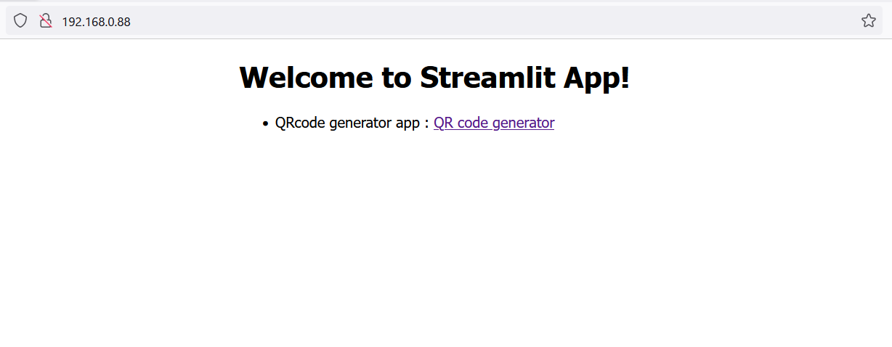
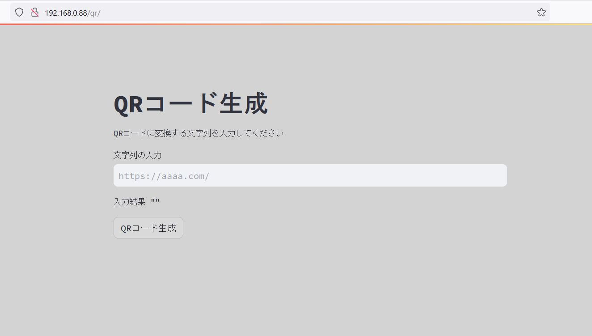
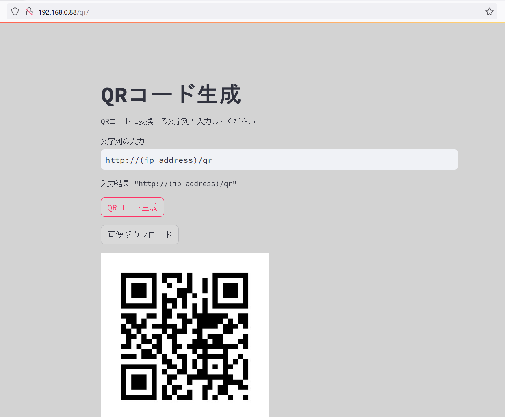

# qrcode_web
Web interface of Python qrcode module with Streamlit+Nginx

## how to use

1. download this repository
```
> git clone https://github.com/aktnk/qrcode_web.git
```

2. execute docker compose
```
> cd qrcode_web
> docker compose up -d --build
```
3. access to http://(your machine ip address) 

* When menu page is opened, click the link of QR code generator.
  
* Enter message text to convert to QR code, and click "QRコード生成" button.
  
* A QR code will then be displayed. If you press the "画像ダウンロード" button, you can save it as a PNG file.
  

## Reference

* Python qrcode module : [python-qrcode](https://github.com/lincolnloop/python-qrcode)
* Streamlit API reference : [Streamlit API documen](https://docs.streamlit.io/develop/api-reference)
* Streamlit tutorials : [Deploy Streamlit using Docker](https://docs.streamlit.io/deploy/tutorials/docker)
* Streamlit discussion topics : [Deploy streamlit with nginx + docker](https://discuss.streamlit.io/t/deploy-streamlit-with-nginx-docker/52907)
